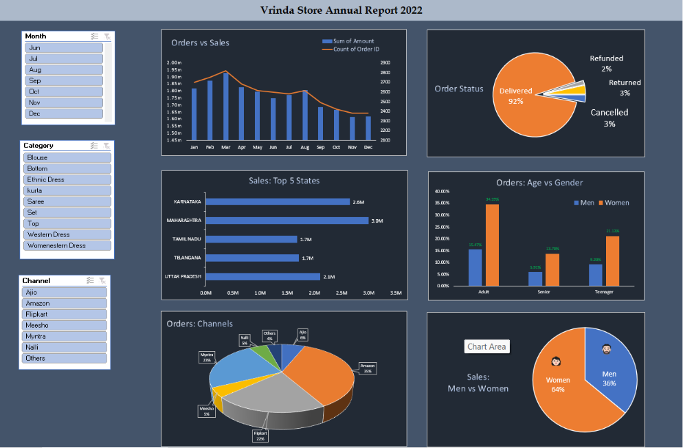

# 🛍️ Vrinda Store Sales Dashboard — Excel Data Analytics Project

A complete sales data analysis of **Vrinda Store**, built using **Advanced Excel**, **Pivot Tables**, and **Pivot Charts** to uncover customer purchasing behavior, sales trends, and growth opportunities.

---

## 📌 Project Overview

This project analyzes Vrinda Store's annual sales data to identify:
- Customer purchasing behavior
- Sales trends across time, states, and channels
- Business growth opportunities

The workflow covered **data cleaning, preprocessing, analysis, and dashboard design** to turn raw sales data into actionable business insights.

---

## 🧰 Tools & Skills Used

- Advanced Excel
- Pivot Tables & Pivot Charts
- Data Cleaning
- Data Preprocessing
- Data Visualization
- Interactive Dashboard Design

---

## 📊 Dashboard Highlights

The interactive dashboard (`Vrinda Store Report 2022` tab) includes:
- Orders vs Sales trend (monthly)
- Order Status breakdown (Delivered, Refunded, Returned, Cancelled)
- Sales by Top 5 States
- Orders: Age vs Gender
- Orders by Channel (Amazon, Flipkart, Myntra, Ajio, etc.)
- Sales: Men vs Women split

Filters for **Month**, **Category**, and **Channel** allow interactive drill-down into the data.

---

## 🔑 Key Insights

- 📈 Highest sales were recorded in **March**
- 👩 **Women customers** contributed around **65%** of total sales
- 🎯 The **30–49 age group (Adults)** placed the most orders
- 🗺️ **Maharashtra, Karnataka, and Uttar Pradesh** were the top-performing states
- 🛒 **Amazon, Flipkart, and Myntra** generated the highest sales contribution
- ✅ The majority of orders were **successfully delivered**

---

## 💡 Conclusion

The analysis suggests Vrinda Store can boost sales by targeting **women customers aged 30–49** from **Maharashtra, Karnataka, and Uttar Pradesh** through targeted ads, offers, and coupons on **Amazon, Flipkart, and Myntra**.

This project strengthened my understanding of customer behavior analysis, sales trend identification, and how data-driven insights support business decision-making.

---

## 📁 Repository Contents

| File | Description |
|------|--------------|
| `Vrinda Store Data Analysis.xlsx` | Full Excel workbook with raw data, pivot tables, pivot charts, and dashboard |
| `Vrinda Store Sales Dashboard.pdf` | Project report summarizing the analysis, dashboard preview, and insights |
| `Dashboard Preview.png` | Dashboard preview image shown above |

---

## 🚀 How to Use

1. Download `Vrinda_Store_Data_Analysis.xlsx`
2. Open in Microsoft Excel (2016 or later recommended for full Pivot Chart support)
3. Navigate to the **Vrinda Store Report 2022** tab to explore the interactive dashboard
4. Use the slicers (Month, Category, Channel) to filter and explore the data

---

## 📬 Contact

Feel free to connect if you'd like to discuss this project or collaborate!

- **LinkedIn:** https://www.linkedin.com/in/sapkalaaditya/
- **Email:** sapkalaaditya5@gmail.com
